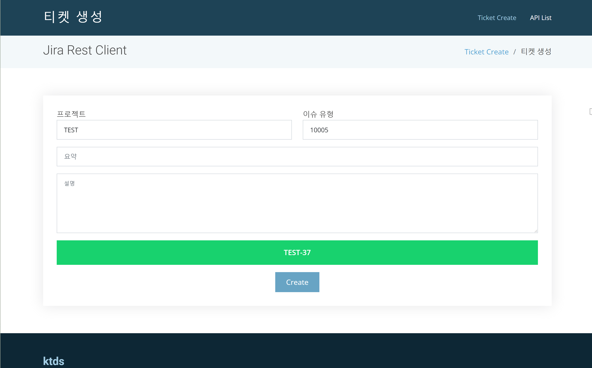

* 스크린샷

  

* 기능

  * 티켓 생성

    : 지정한 프로젝트, 이슈 유형으로 jira ticket을 생성 한다.

  * rest api (swagger)

    : 제공되는 rest api 

* 시작하기

  * gradle bootRun

* 프로젝트 설정

  * application.yml

    ```yaml
    server:
      port: 8081(기동 포트 정보)
    jira:
      username: thinkhero(jira user id)
      password: P@ssw0rd(password)
      jiraUrl: http://localhost:8080(jira base URL)
      projectKey: TEST(티켓 생성할 프로젝트 키)
      # get from http://{jiraUrl}localhost:8080/secure/admin/ViewIssueTypes.jspa
      issueType: 10005(티켓 생성할 issueType)
    ```

    ​

